# 💧Peristaltic Water Pump Controller for Aeroponic Towers - [IIT Mandi CCA Project]

An automated water level management system for aeroponic towers using NodeMCU ESP8266 with 4-channel relay control. This system maintains optimal water levels in aeroponic cultivation systems by automatically triggering water pumps based on real-time water level monitoring.

[](https://www.arduino.cc/)
[](https://www.espressif.com/)

---

## 📑 Table of Contents

- [Overview](#overview)
- [Features](#features)
- [System Architecture](#system-architecture)
- [Hardware Components](#hardware-components)
- [Software Stack](#software-stack)
- [Installation](#installation)
  - [Hardware Setup](#hardware-setup)
  - [Software Setup](#software-setup)
- [Working Principle](#working-principle)
- [Applications](#applications)

---

## 🎯 Overview

The **Water Pump Controller for Aeroponic Towers** is part of the Controlled Climate Agriculture (CCA) project at IIT Mandi's School of Computing and Electrical Engineering (SCEE). This automated system monitors and maintains water levels in aeroponic towers, ensuring continuous recirculation and optimal moisture for plant growth.

### Key Objectives

- ✅ Maintain optimal water levels in aeroponic towers
- ✅ Automate water pump operation based on real-time monitoring
- ✅ Prevent water shortage due to plant absorption and evaporation
- ✅ Enable simultaneous control of multiple aeroponic towers
- ✅ Ensure continuous water recirculation for plant health

---

## ✨ Features

### Automation Features
- 💧 **Real-time Water Level Monitoring** using digital float switches
- 🔄 **Automatic Pump Control** via 4-channel relay module
- 🌱 **Multi-Tower Support** - control up to 4 aeroponic towers simultaneously
- ⚡ **Instant Response** - immediate pump activation on low water detection
- 💾 **Digital Output Monitoring** through Serial Monitor

### Technical Features
- 🔌 **4-Channel Relay Module** for independent pump control
- 📊 **Real-time Status Display** via Serial Monitor
- 🛡️ **Isolated Control** using optocouplers for safety
- ⚡ **High Current Handling** - supports pumps up to 10A per channel
- 💡 **LED Status Indicators** on relay module

### System Capabilities
- 🌊 **Precise Water Management** - maintains required water quantity
- 🔄 **Continuous Operation** - 24/7 monitoring and control
- 🎯 **Independent Channel Control** - each tower operates autonomously
- 📈 **Scalable Design** - easily expandable to more towers
- 🔧 **Simple Integration** - minimal wiring and setup required

---

## 🏗️ System Architecture

```mermaid
graph TD
    subgraph "WATER LEVEL SENSING"
        A1["💧 Water Level Sensor<br/>Tower 1<br/>Digital Float Switch"]
        A2["💧 Water Level Sensor<br/>Tower 2<br/>Digital Float Switch"]
        A3["💧 Water Level Sensor<br/>Tower 3<br/>Digital Float Switch"]
        A4["💧 Water Level Sensor<br/>Tower 4<br/>Digital Float Switch"]
    end

    subgraph "CONTROL UNIT"
        B["🖥️ NodeMCU ESP8266<br/>Signal Processing<br/>Decision Logic"]
    end

    subgraph "RELAY MODULE"
        C["⚡ 4-Channel Relay Module<br/>Channel 1: Relay 1<br/>Channel 2: Relay 2<br/>Channel 3: Relay 3<br/>Channel 4: Relay 4"]
    end

    subgraph "WATER PUMPS"
        D1[" Peristaltic Pump 1<br/>12V 5000 RPM"]
        D2[" Peristaltic Pump 2<br/>12V 5000 RPM"]
        D3[" Peristaltic Pump 3<br/>12V 5000 RPM"]
        D4[" Peristaltic Pump 4<br/>12V 5000 RPM"]
    end

    subgraph "MONITORING"
        E["💻 Serial Monitor<br/>Real-time Status<br/>Water Level Display"]
    end

    A1 --> B
    A2 --> B
    A3 --> B
    A4 --> B
    B --> C
    C --> D1
    C --> D2
    C --> D3
    C --> D4
    B --> E

    style A1 fill:#11998e,stroke:#0d7a6f,stroke-width:2px,color:#fff
    style A2 fill:#11998e,stroke:#0d7a6f,stroke-width:2px,color:#fff
    style A3 fill:#11998e,stroke:#0d7a6f,stroke-width:2px,color:#fff
    style A4 fill:#11998e,stroke:#0d7a6f,stroke-width:2px,color:#fff
    style B fill:#f093fb,stroke:#d66de8,stroke-width:2px,color:#fff
    style C fill:#feca57,stroke:#ee5a24,stroke-width:2px,color:#fff
    style D1 fill:#fa709a,stroke:#f54278,stroke-width:2px,color:#fff
    style D2 fill:#fa709a,stroke:#f54278,stroke-width:2px,color:#fff
    style D3 fill:#fa709a,stroke:#f54278,stroke-width:2px,color:#fff
    style D4 fill:#fa709a,stroke:#f54278,stroke-width:2px,color:#fff
    style E fill:#48dbfb,stroke:#0abde3,stroke-width:2px,color:#fff
```



### Control Flow
1. **Water Level Monitoring** - Digital float switches continuously monitor water levels in each aeroponic tower
2. **Signal Processing** - NodeMCU ESP8266 reads digital signals from all water level sensors
3. **Decision Logic** - When water level falls below threshold (sensor shows HIGH/1), corresponding relay is triggered
4. **Pump Activation** - Relay closes circuit, activating the water pump for that specific tower
5. **Water Refilling** - Pump draws water into the tower, raising the water level
6. **Automatic Shutoff** - When water reaches required level (sensor shows LOW/0), relay opens and pump stops
7. **Continuous Cycle** - Process repeats independently for each tower

---

## 🔧 Hardware Components

| Component | Model | Purpose | Specifications |
|-----------|-------|---------|----------------|
| **Microcontroller** | NodeMCU ESP8266 | Signal processing & control logic | 80MHz, 4MB flash, (arduino NANO or UNO can also be used) |
| **Relay Module** | 4-Channel 5V | Pump switching control | 10A/250VAC, 10A/30VDC per channel |
| **Water Pump** | Peristaltic 12V | Water transfer to towers | 5000 RPM, 0.1-100ml/min flow rate |
| **Water Level Sensor** | Digital Float Switch | Water level detection | Digital output (HIGH/LOW) |

### Detailed Component Specifications

#### NodeMCU ESP8266
- **Microcontroller**: ESP8266 (8266)
- **Clock Speed**: 80MHz (overclockable to 160MHz)
- **Flash Memory**: 4MB
- **GPIO Pins**: 17 (some shared with other functions)
- **Operating Voltage**: 5V via USB or external supply
- **Interfaces**: UART, SPI, I2C, PWM
- **ADC**: 10-bit, 1 input
- **Wi-Fi**: 802.11 b/g/n

#### 4-Channel Relay Module
- **Supply Voltage**: 3.75V to 6V
- **Trigger Current**: 5mA
- **Active Current**: ~70mA (single relay), ~300mA (all four relays)
- **Relay Type**: 5V electromagnetic relay
- **Contact Rating**: 
  - AC: 250V, 10A maximum
  - DC: 30V, 10A maximum
- **Isolation**: Optocoupler isolation between control and load circuits
- **LED Indicators**: Individual LED for each relay status
- **Components**: 
  - 5V relays × 4
  - Terminal blocks for connections
  - Male headers for microcontroller interface
  - Transistors for relay driving
  - Optocouplers for isolation
  - Flyback diodes for protection
  - Status LEDs × 4

#### Peristaltic Water Pump (12V)
- **Operating Voltage**: 12V DC
- **Speed**: 5000 RPM
- **Flow Rate**: 0.1 to 100 ml/min (adjustable)
- **Speed Range**: 0.1 to 5000 RPM
- **Operating Temperature**: 0°C to 40°C
- **Relative Humidity**: <80%
- **Pump Type**: Positive displacement (roller pump)
- **Working Principle**:
  - Flexible tube contained in circular pump casing
  - Rotor with rollers attached to external circumference
  - Rollers compress flexible tube, forcing fluid movement
  - Tube reopens after roller passes, drawing more fluid
- **Features**:
  - Self-priming capability
  - No contamination of fluid
  - Easy tube replacement
  - Bidirectional flow capability

#### Water Level Sensor (Digital Float Switch)
- **Type**: Magnetic float switch
- **Output**: Digital (HIGH when water low, LOW when water sufficient)
- **Operating Voltage**: 3.3V to 5V compatible
- **Mounting**: Vertical mounting in aeroponic tower
- **Material**: Corrosion-resistant plastic
- **Connection**: 3-wire connection (VCC, GND, Signal)

---

## 💻 Software Stack

### Development Environment
- **IDE**: Arduino IDE 2.0 or higher
- **Programming Language**: Arduino C/C++
- **Board**: NodeMCU ESP8266
- **Communication**: Serial (for monitoring)

### Key Arduino Libraries
```cpp
// Core Arduino functions
#include <Arduino.h>

// No additional libraries required for basic operation
```

### Required Libraries Installation
- Arduino Core (Built-in)
- No external libraries needed for this project

---

## 📥 Installation

### Hardware Setup

#### Required Components
- NodeMCU ESP8266 × 1
- 4-Channel 5V Relay Module × 1
- Peristaltic Water Pump (12V, 5000 RPM) × 4
- Water Level Sensor (Digital Float Switch) × 4
- 12V DC Power Supply (for pumps)
- 5V DC Power Supply (for NodeMCU and relay module)
- Connecting wires
- Breadboard or PCB for prototyping
- Aeroponic towers × 4

#### Pin Connections

**Water Level Sensors to NodeMCU:**
```
Sensor 1 Signal  →  GPIO D1 (Digital Pin)
Sensor 2 Signal  →  GPIO D2 (Digital Pin)
Sensor 3 Signal  →  GPIO D3 (Digital Pin)
Sensor 4 Signal  →  GPIO D4 (Digital Pin)
All Sensors VCC  →  3.3V or 5V
All Sensors GND  →  GND
```

**NodeMCU to 4-Channel Relay Module:**
```
NodeMCU Pin      →    Relay Module
GPIO D5          →    IN1 (Relay 1 Control)
GPIO D6          →    IN2 (Relay 2 Control)
GPIO D7          →    IN3 (Relay 3 Control)
GPIO D8          →    IN4 (Relay 4 Control)
5V               →    VCC
GND              →    GND
```

**Relay Module to Water Pumps:**
```
Relay 1 COM      →    12V Power Supply (+)
Relay 1 NO       →    Pump 1 (+)
Pump 1 (-)       →    12V Power Supply (-)

Relay 2 COM      →    12V Power Supply (+)
Relay 2 NO       →    Pump 2 (+)
Pump 2 (-)       →    12V Power Supply (-)

Relay 3 COM      →    12V Power Supply (+)
Relay 3 NO       →    Pump 3 (+)
Pump 3 (-)       →    12V Power Supply (-)

Relay 4 COM      →    12V Power Supply (+)
Relay 4 NO       →    Pump 4 (+)
Pump 4 (-)       →    12V Power Supply (-)
```

**Note**: COM = Common terminal, NO = Normally Open terminal

#### Assembly Steps

1. **Breadboard Setup**
   - Place NodeMCU ESP8266 on breadboard
   - Position 4-channel relay module nearby
   - Ensure proper spacing for wire connections

2. **Water Level Sensor Installation**
   - Mount digital float switches vertically in each aeroponic tower
   - Position at desired minimum water level
   - Secure firmly to prevent movement
   - Run wires to NodeMCU location

3. **Sensor Wiring**
   - Connect water level sensor signals to designated GPIO pins (D1-D4)
   - Connect all sensor VCC pins to common 5V rail
   - Connect all sensor GND pins to common ground rail
   - Use appropriate wire lengths to reach each tower

4. **Relay Module Connection**
   - Connect relay control pins (IN1-IN4) to NodeMCU GPIO pins (D5-D8)
   - Power relay module from 5V supply
   - Connect relay module GND to common ground

5. **Pump Wiring**
   - Connect pump positive terminals to relay NO (Normally Open) terminals
   - Connect all pump negative terminals to 12V power supply negative
   - Connect relay COM terminals to 12V power supply positive
   - Ensure proper polarity to avoid damage

6. **Power Supply Setup**
   - Use separate 12V power supply for water pumps (higher current)
   - Use 5V power supply for NodeMCU and relay module
   - Ensure common ground between all power supplies
   - Check current ratings meet system requirements

7. **Physical Installation**
   - Position water pumps near water reservoir
   - Run pump outlet tubes to respective aeroponic towers
   - Secure all tubing connections
   - Ensure pumps are below water reservoir level (if not self-priming)

8. **Testing Before Operation**
   - Verify all connections are secure
   - Check power supply voltages
   - Test relay clicking sound when triggered manually
   - Verify water level sensor output using Serial Monitor
   - Test individual pump operation

#### Circuit Schematic


#### Breadboard Implementation


---

### Software Setup

#### Prerequisites
- Arduino IDE 2.0 or higher installed
- ESP8266 Board Support installed in Arduino IDE
- Basic knowledge of Arduino programming
- USB cable for NodeMCU programming

#### Arduino IDE Configuration

1. **Install ESP8266 Board Support**
```
   File → Preferences → Additional Board Manager URLs
   Add: http://arduino.esp8266.com/stable/package_esp8266com_index.json
   Tools → Board → Board Manager → Search "ESP8266" → Install
```

2. **Board Selection**
```
   Tools → Board → ESP8266 Boards → NodeMCU 1.0 (ESP-12E Module)
   Tools → Upload Speed → 115200
   Tools → CPU Frequency → 80 MHz
   Tools → Flash Size → 4MB (FS:2MB OTA:~1019KB)
```

#### Code Configuration

1. **Clone Repository**
```bash
   git clone https://github.com/yourusername/water-pump-controller.git
   cd water-pump-controller
```

2. **Configure Pin Definitions**
   Edit main sketch file:
```cpp
   // Water Level Sensor Pin Definitions
   #define WATER_SENSOR_1 D1    // Tower 1 water level sensor
   #define WATER_SENSOR_2 D2    // Tower 2 water level sensor
   #define WATER_SENSOR_3 D3    // Tower 3 water level sensor
   #define WATER_SENSOR_4 D4    // Tower 4 water level sensor
   
   // Relay Control Pin Definitions
   #define RELAY_1 D5           // Pump 1 relay control
   #define RELAY_2 D6           // Pump 2 relay control
   #define RELAY_3 D7           // Pump 3 relay control
   #define RELAY_4 D8           // Pump 4 relay control
```

3. **Configure Timing Parameters**
```cpp
   // Timing Configuration
   const unsigned long SENSOR_CHECK_INTERVAL = 1000;  // Check sensors every 1 second
   const unsigned long PUMP_MIN_RUN_TIME = 5000;      // Minimum pump run time (5 seconds)
```

4. **Upload Code**
   - Open `water_pump_controller.ino` in Arduino IDE
   - Connect NodeMCU ESP8266 via USB
   - Select correct COM port: `Tools → Port`
   - Click Upload button
   - Monitor Serial output: `Tools → Serial Monitor` (115200 baud)

5. **Initial Testing**
   - Open Serial Monitor after upload
   - Verify sensor initialization messages
   - Check water level sensor readings (0 or 1)
   - Manually simulate low water level
   - Confirm relay activation and pump operation
   - Monitor LED indicators on relay module

#### Code Structure
```
water-pump-controller/
├── water_pump_controller.ino    # Main Arduino sketch
├── config.h                      # Configuration settings
├── README.md                     # This file
├── LICENSE                       # License file
├── circuit_diagram.png           # Circuit schematic
└── breadboard_setup.png          # Breadboard layout
```

---

## 🔄 Working Principle

The Water Pump Controller operates on a simple yet effective feedback control mechanism:

### System Operation

1. **Continuous Monitoring**
   - NodeMCU continuously reads digital signals from all four water level sensors
   - Each sensor provides either HIGH (1) or LOW (0) output
   - HIGH signal indicates water level below threshold (needs refilling)
   - LOW signal indicates sufficient water level

2. **Decision Logic**
   - When any sensor detects low water (HIGH output):
     - NodeMCU identifies which tower needs water
     - Corresponding relay is triggered
     - Relay closes the circuit
     - Water pump for that tower activates
   - All towers operate independently and simultaneously

3. **Water Refilling Process**
   - Activated pump draws water from reservoir
   - Water flows through tubing into aeroponic tower
   - Water level gradually rises
   - Plants continue receiving moisture from recirculation

4. **Automatic Shutoff**
   - As water level rises, float switch lifts
   - Sensor output changes from HIGH to LOW
   - NodeMCU detects sufficient water level
   - Relay is deactivated (circuit opens)
   - Pump stops automatically

5. **Serial Monitoring**
   - Real-time sensor status displayed on Serial Monitor
   - Shows which towers have adequate water (0)
   - Shows which towers need water refill (1)
   - Helps in system debugging and monitoring

### Control Logic Flow
```
[Water Level Sensor] → [Read Digital Signal] → [LOW (0)?] → [Sufficient Water] → [Keep Relay OFF]
                                                    ↓
                                                [HIGH (1)?]
                                                    ↓
                                            [Water Below Threshold]
                                                    ↓
                                            [Activate Relay]
                                                    ↓
                                            [Turn ON Pump]
                                                    ↓
                                            [Water Fills Tower]
                                                    ↓
                                            [Level Reaches Threshold]
                                                    ↓
                                            [Sensor Goes LOW]
                                                    ↓
                                            [Deactivate Relay]
                                                    ↓
                                            [Turn OFF Pump]
```

### Key Operating Characteristics

**Aeroponic Tower Water Management:**
- Aeroponic towers maintain moisture through water recirculation
- Water quantity decreases due to:
  - Plant absorption during growth
  - Evaporation from exposed surfaces
  - System leakage (if any)
- Minimum water quantity required for effective recirculation
- Below minimum level, pump efficiency drops significantly

**Relay Module Operation:**
- Relays use optocoupler isolation for safety
- Control circuit (NodeMCU) electrically isolated from load circuit (pumps)
- Each relay operates independently
- LED indicator shows relay status (ON/OFF)
- Low trigger current (5mA) minimizes NodeMCU load

**Pump Characteristics:**
- Peristaltic design prevents fluid contamination
- Self-priming capability (can start dry)
- Positive displacement ensures consistent flow
- Flow rate: 0.1-100 ml/min based on speed control
- Bidirectional flow capability (not used in this application)

---

## 🌱 Applications

### Controlled Climate Agriculture (CCA)

1. **Aeroponic Tower Automation**
   - Maintains optimal water levels for plant root misting
   - Ensures continuous nutrient delivery to plants
   - Prevents pump dry-running and damage
   - Supports multiple growing stations simultaneously

2. **Resource Optimization**
   - Automated operation reduces manual monitoring labor
   - Prevents water wastage from overfilling
   - Ensures timely refilling prevents plant stress
   - Maintains consistent growing conditions

3. **Hydroponic Systems**
   - Adaptable to other hydroponic setups (NFT, DWC, Ebb & Flow)
   - Can control nutrient solution levels
   - Manages water temperature regulation systems
   - Maintains reservoir levels for recirculating systems

4. **Greenhouse Integration**
   - Part of larger controlled environment agriculture setup
   - Works alongside temperature and humidity control
   - Integrates with nutrient management systems
   - Supports precision agriculture practices

### System Scalability

**Current Implementation:**
- 4 aeroponic towers with independent control
- Single NodeMCU ESP8266 controller
- 4-channel relay module

**Expansion Possibilities:**
- Add more relay modules for additional towers
- Implement wireless control via ESP8266 Wi-Fi
- Integrate with cloud platforms (ThingSpeak, Blynk)
- Add flow rate monitoring for each pump
- Implement pump scheduling and timers
- Connect to mobile app for remote monitoring
- Add water quality sensors (pH, TDS, temperature)

---

## 📊 System Benefits

### Automation Benefits
- ✅ **24/7 Operation** - Continuous monitoring without human intervention
- ✅ **Instant Response** - Immediate pump activation on low water detection
- ✅ **Labor Reduction** - Eliminates manual water level checking
- ✅ **Consistent Operation** - Reliable performance regardless of external factors

### Plant Health Benefits
- ✅ **Optimal Moisture** - Maintains ideal water levels for root health
- ✅ **Stress Prevention** - Avoids water shortage stress on plants
- ✅ **Growth Enhancement** - Consistent water availability supports better growth
- ✅ **Root Protection** - Prevents root drying in aeroponic systems

### Operational Benefits
- ✅ **Equipment Protection** - Prevents pump damage from dry running
- ✅ **Water Conservation** - Automated shutoff prevents overflow
- ✅ **Energy Efficiency** - Pumps run only when needed
- ✅ **Maintenance Reduction** - Less wear on equipment from optimal operation

### Economic Benefits
- ✅ **Cost Savings** - Reduced labor and water costs
- ✅ **Yield Improvement** - Better plant health leads to higher yields
- ✅ **Equipment Longevity** - Proper pump operation extends lifespan
- ✅ **Scalability** - Easy expansion to more towers without complexity increase

---

## 🔧 Maintenance and Troubleshooting

### Regular Maintenance
- Check water level sensor operation weekly
- Clean float switches to prevent sticking
- Inspect pump tubing for wear or leaks
- Verify relay contacts for wear (annually)
- Clean relay module from dust accumulation
- Check all electrical connections for corrosion

### Common Issues and Solutions

**Pump not activating:**
- Check water level sensor signal on Serial Monitor
- Verify relay clicking sound when triggered
- Test 12V power supply voltage
- Inspect pump wiring connections

**Pump runs continuously:**
- Check float switch positioning
- Verify sensor output (should go LOW when water is sufficient)
- Test sensor by manually lifting float
- Check NodeMCU GPIO pin configuration

**Multiple pumps not working:**
- Verify NodeMCU power supply (may be insufficient current)
- Check common ground connections
- Test relay module power supply
- Inspect relay module for damage

---
